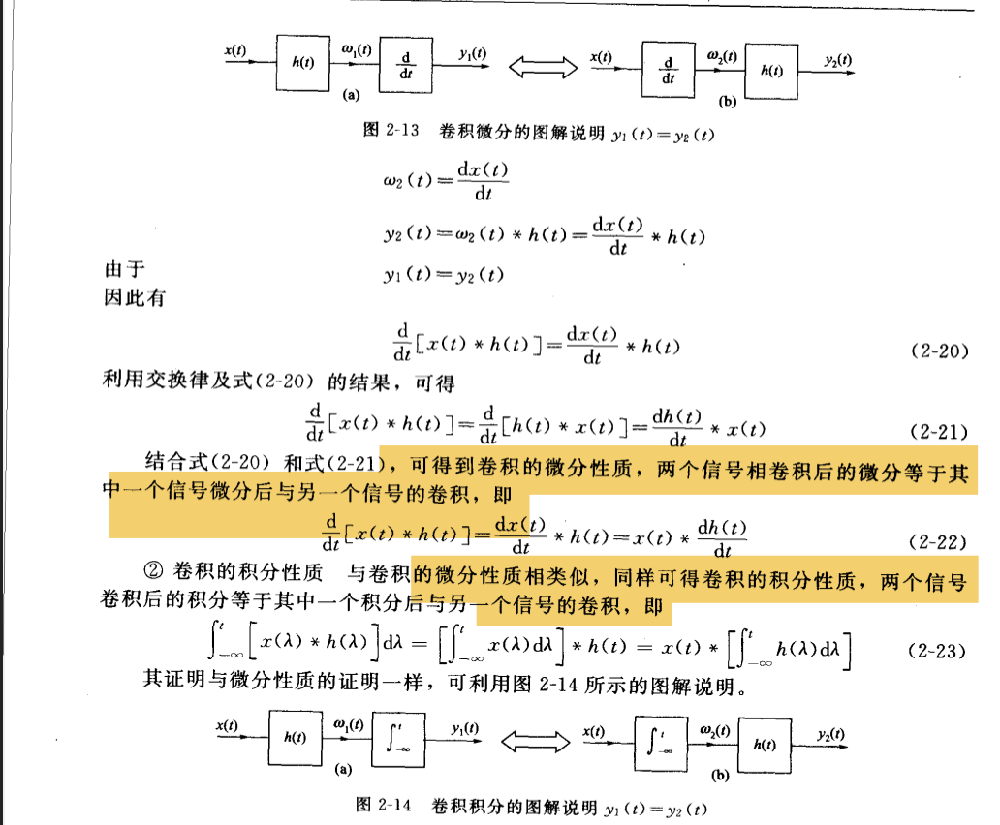

微分是一种很特殊的系统：
具有线性时不变性，
具有记忆性：因为和周围的数据有关
同时有因果性：
微分器是一个满足因果性的系统，原因如下：

1. **因果系统的定义**：系统的输出仅依赖于当前和过去的输入，不依赖未来输入。即对于任意时刻 \( t \)，输出 \( y(t) \) 仅由输入 \( x(\tau) \)（其中 \( \tau \leq t \)）决定。

2. **微分器的冲激响应**：在连续时间系统中，微分器的冲激响应为 \( h(t) = \delta'(t) \)，即单位冲激函数的一阶导数。虽然数学上导数需要两侧的极限，但 \( \delta'(t) \) 的支撑集（非零区域）仅在 \( t=0 \) 处，且在 \( t<0 \) 时为零。这表明系统的响应仅发生在输入作用之后（因果性）。

3. **卷积分析**：系统的输出 \( y(t) \) 是输入 \( x(t) \) 与冲激响应 \( h(t) \) 的卷积：
   \[
   y(t) = x(t) * \delta'(t) = \frac{dx(t)}{dt}.
   \]
   由于 \( \delta'(t) \) 在 \( t<0 \) 时为零，卷积结果 \( y(t) \) 仅依赖 \( x(t) \) 在 \( \tau \leq t \) 的值，不涉及未来信息。

4. **物理可实现性**：尽管数学上的导数需要极限操作，但在物理系统中，微分器通过因果的冲激响应 \( \delta'(t) \) 实现，确保实时处理时无需预知未来输入。

**结论**：微分器满足因果性，因为其冲激响应 \( \delta'(t) \) 在负时间域为零，且输出仅由当前和过去的输入决定。这一特性在连续时间系统中严格成立，确保了微分器的因果性。

上述的论证：

利用了线性时不变的交换律
